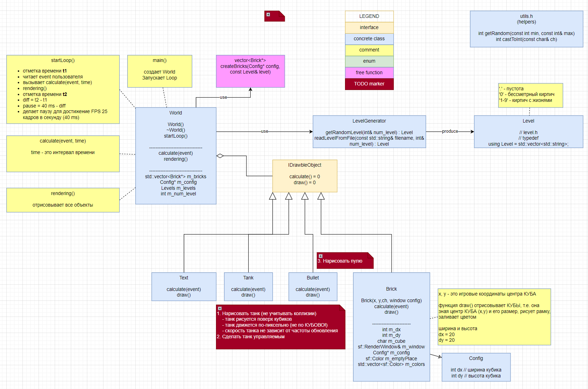

# Tanks 2

## Описание игры

Копия известной игры на Sega - Battle City.

ВСТАВИТЬ СКРИНШОТ c НОРМАЛЬНЫМ УРОВНЕМ

## Возможности

- Уровень загружается из текстового файла, который можно легко редактировать.
- Танк передвигается на стрелочки.
- Работа с коллизиями на местности не реализована.

## Диаграмма классов (UML)

## TODO

- Танк.
  - Танк стреляет.
  - Танк может управляться ботом, может человеком.
  - Звуки взрыва и выстрела.
  - Взрыв танка меняет его цвет и он исчезает.
- Инсталлятор игры.

